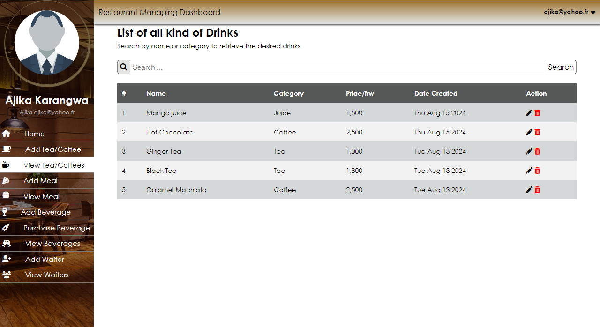

# Restaurant Management System

This is a restaurant management system built using React and Django.

## Installation

Clone the repository by ` git clone https://github.com/karangwaajika/django-resto-app.git`

## Usage

- Front-end: React
  - The client side is designed using pure CSS, HTML, and React.
  - You must ensure you have the necessary tools to run a React app.
- Back-end: Django
  - The server side is handled by Django Rest API.
  - Data are stored in sqlite3.

## Contributing

This repo is to put what I've been learning into practice.
Therefore, pull requests are welcome to gain more experience from you.
